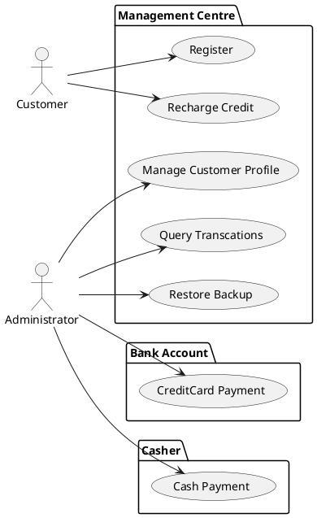
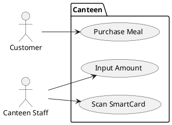
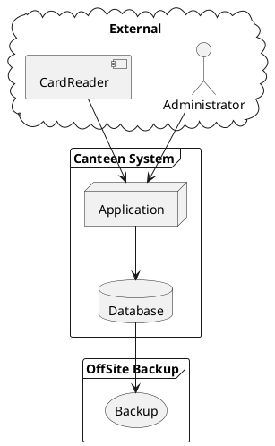
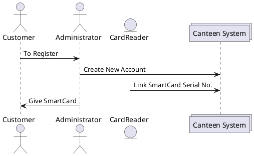
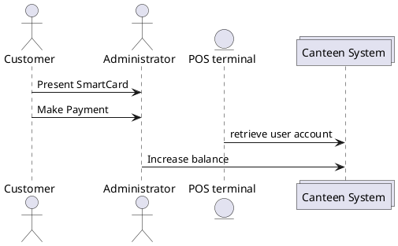
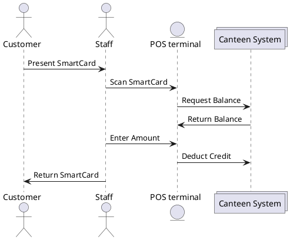
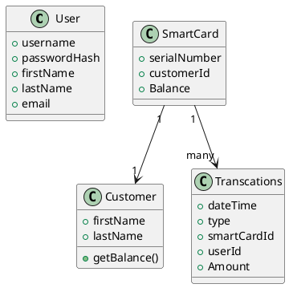

# 1 System Summary

Canteen SmartCard System is a cashless payment system that used in xxx canteen

## 1.1 Functional Summary

- A SmartCard is issued to every consumer in the system.
- Consumer recharge the credit in the Management Center
- Administrator of Management Center manage the card holders' balance and identity.

## 1.2 Non-functional Summary

- Data backup is required in case of system failure.

# 2 Use Cases

## 2.1 Management Center

- A customer can register an account in the system.
- Customer can recharge his/her balance by Credit Card or Cash
- A administrator can mange customer profile
- A administrator can query customer transactions
- A administrator can charge customer by credit card to the canteen's bank account.
- A administrator can charge customer by cash.

## 2.2 Canteen

- Customer purchase the meal
- Canteen staff input the amount of the Meal
- Canteen staff scan customer's smart card

# 3 System deployment and overall design

## 3.1 Deployment Diagram

## 3.2 Management Center Sequence diagram

### 3.2.1 Open new account

### 3.2.2 Customer recharge credit

## 3.3 Canteen Sequence diagram

# 4 Class Diagram

