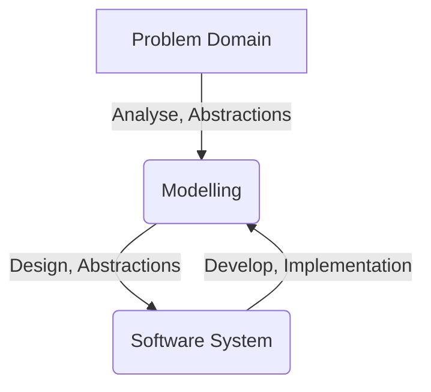
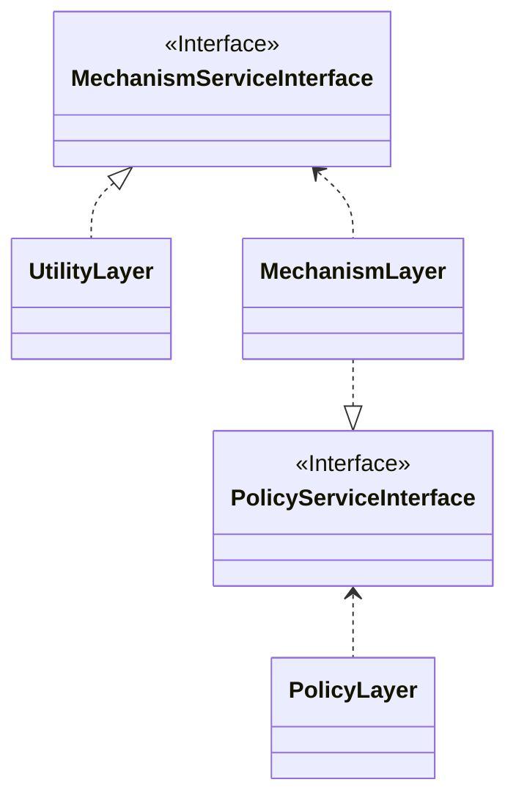

## Computing/Programming history

### Basics
- Programming is a process that build up the and connection between Modelling (Solutions domain) that computer can understand and the real world (Problem domain)

#### Abstractions of
  - Computing/ Caluclations
  - Problem Domain
  - Elements inside Problem Domain

#### Core elements
  - Human
  - Computer
  - Business Domain

### Ojbect Oriented Programming

#### Encapsulation
  - Hide the implementation(access control)
  - Define interfaces

#### Inheritance
  - Is-A
  - Has-A

#### Polymorphism
  - late binding
  - Up Casting

### Design Patterns

Basic types:
  - Creational: Creational patterns are used to create objects for a suitable class that serves as a solution for a problem
  - Behavioral: Behavioral patterns describe interactions between objects and focus on how objects communicate with each other.
  - Structural: Structural patterns form larger structures from individual parts, generally of different classes

### Framework

## Principles of OOP

#### Design objective
To archive `High cohesion and low coupling`

- extendable: easy to add new features
- durable: not esay to be broken
- migratable: on multi platforms/enviroments
- simple: easy to understand and maintain

#### Bad smells

- Rigidity: not easy to change
- Fragility: easy to be broken, only want to change A, but B also broken
- Immobility: not able to migrate to different enviroments
- Viscosity: easier to do bad thing than the good one
- Opacity: hard to understand
- Needless Complexity/Repetition: over engineering/ copy-paste code

## SOLID principle

### Open/Close principle
software entities (classes, modules, functions, etc.) should be open for extension, but closed for modification.

implementations:
- split interface
- Strategy pattern
- Adaptor pattern
- Observer pattern

### Dependency inversion principle(DIP)
the conventional dependency relationships established from high-level, policy-setting modules to low-level, dependency modules are reversed, thus rendering high-level modules independent of the low-level module implementation details

  - High-level modules should not depend on low-level modules. Both should depend on abstractions (e.g. interfaces).
  - Abstractions should not depend on details. Details (concrete implementations) should depend on abstractions.

also call as `Hollywood principle`,
  - Don't call me, I'll call you.

### Liskov substitution
subclasses should satisfy the expectations of clients accessing subclass objects through references of superclass type, not just as regards syntactic safety (such as absence of "method-not-found" errors) but also as regards behavioral correctness

- in short: subtype should be able to replace its base type
- it's correct way to do inheritence

Implemenetations:
- extract base type
- composition

### Single-responsibility principle (SRP)

A class should have only one reason to change.

- also called `Cohesion`
- reason: This principle is about people
- responsibility: reason to change

### Interface segregation principle (ISP)
No client should be forced to depend on methods it does not use.

relationship betwen SRP and ISP
- they are about `Cohesion`
- SRP is for how to design a `Class`: only one reason to change
- ISP is for how to design an `Interface`, methods that clients don't need should not be accessible