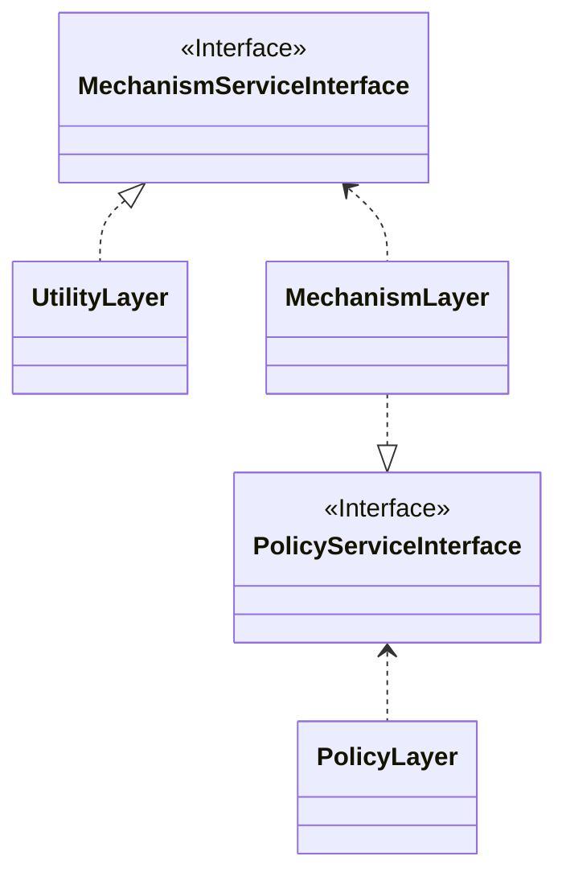
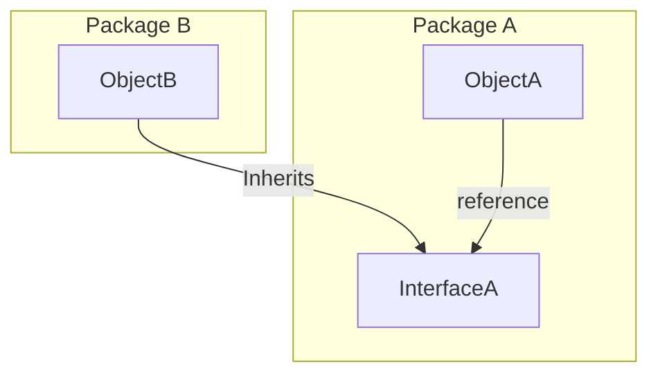
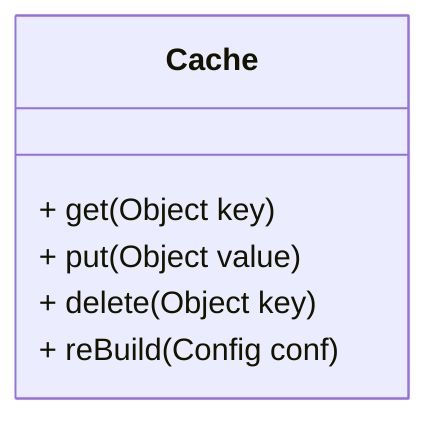
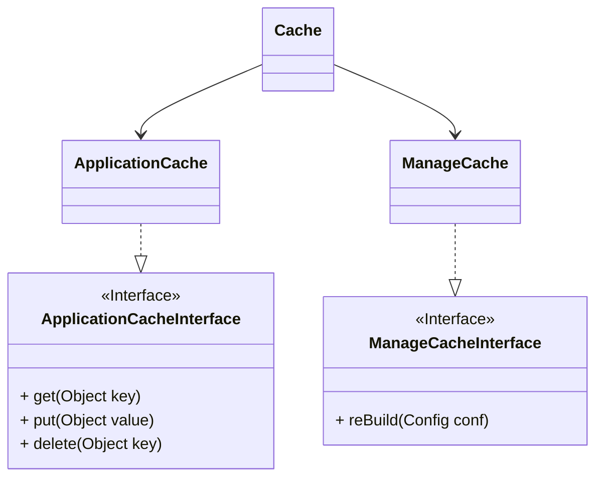

## Q1. Dependency inversion principle (DIP)

In object-oriented design, the dependency inversion principle is a specific form of decoupling software modules. When following this principle, the conventional dependency relationships established from high-level, policy-setting modules to low-level, dependency modules are reversed, thus rendering high-level modules independent of the low-level module implementation details. The principle states:

  - High-level modules should not depend on low-level modules. Both should depend on abstractions (e.g. interfaces).
  - Abstractions should not depend on details. Details (concrete implementations) should depend on abstractions.



Implementations




Hollywood Principle as, “Don’t Call Us, We’ll Call You.”
It illustrates how the Dependency inversion principle works, insteads of calling all the dependencies, develper writes code to resonds to external framework events, and let the framework decide how/when to call the response code.


## Q2. Framework that implementation DIP
for Ruby on Rails framework, it mainly contains 3 layers ( Controller/ Model/ View), the rails framework already defined each layer, for controller for example

```ruby
class MyController < ApplicationController
  def index
    # logic here
    # render :index
  end
end
```

user can write actual logic of the `action` and user can specify which view to render, if user skip the render, rails framework by default will render the view with same name as the action name in controller.
So instead of user write code in controller to call rails 's functions, it's rails controller that call code block that user defined in controller.

## Q3. Cache class design

#### requirements
current `Cache` class has 4 methods, please use `interface-segregation principle` to redesign the class with diagram



#### diagrams

split the class with to 2 interfaces, one for Application and one for internal



#### dummy codes

```ruby
module ApplicationCacheInterface
  def get(key); end
  def put(value); end
  def delete(key); end
end

module ManageCacheInterface
  def rebuild(conf); end
end

class Cache
  # common code here
end

class ApplicationCache < Cache
  include ApplicationCacheInterface
end

class ManageCache < Cache
  include ManageCacheInterface
end

class CacheOjbect
  attr_reader :key, :value
end

class Configuration
  def conf
    # get config file from source
  end
end

```


```ruby
# get cache object
cache_object = CacheOjbect.new

# init application cache
app_cache = ApplicationCache.new

# get object
app_cache.get(cache_object.key)

# update object
app_cache.put(cache_object.value)

# delete object
app_cache.delete(cache_object.key)

# rebuild cache
manage_cache = ManageCache.new
manage_cache.rebuild
```
